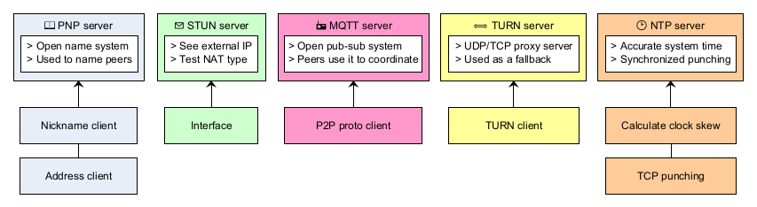

Architecture
--------------

P2PD is built on top of three companion packages that were split out from the original codebase to improve portability and reuse:

- `aionetiface <https://pypi.org/project/aionetiface/>`_ — cross-platform async network interface detection, routing, STUN client, and portable netifaces wrapper.
- `sidewire <https://pypi.org/project/sidewire/>`_ — P2P protocol message definitions and serialization used for peer signaling.
- `namebump <https://pypi.org/project/namebump/>`_ — client for the PNP (Peer Name Protocol) naming system.

All three are installed automatically as dependencies when you install p2pd.

Open protocols ensure the availability of public infrastructure. WebRTC uses STUN and TURN, while MQTT is essential for IoT devices. NTP plays a crucial role in maintaining accurate clocks, a necessary condition for TCP punching.

The only custom service is the naming system, PNP (Peer Name Protocol), created due to the lack of an open, permissioned, registration-free key-value store — essential for programmatically accessible naming in a user-friendly library. See :doc:`../p2p/nicknames` for details.

