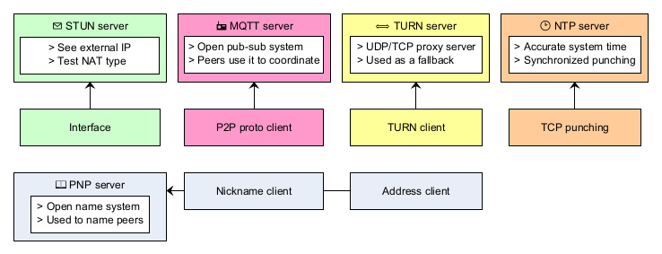

Architecture
--------------

Open protocols ensure the availability of public infrastructure. WebRTC uses STUN and TURN, while MQTT is essential for IoT devices. NTP plays a crucial role in maintaining accurate clocks, a necessary condition for TCP punching.

The only custom service is the naming system, PNP (Peer Name Protocol), created due to the lack of an open, permissioned, registration-free key-value store – essential for programmatically accessible naming for a user-friendly library. See :doc:`../p2p/nicknames` for details.

