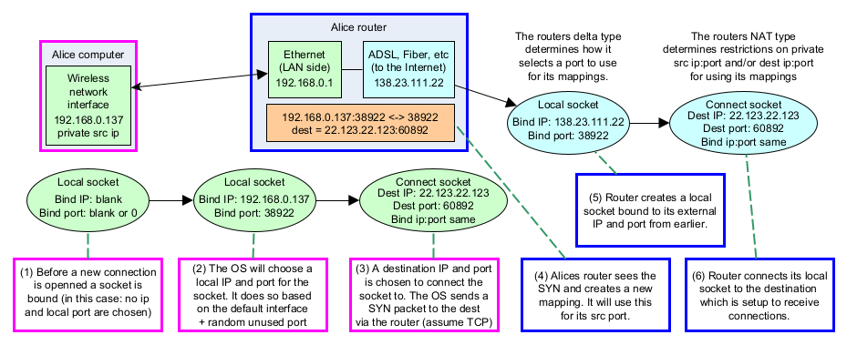

NAT prediction
=========================

.. csv-table::
    :file: ../../diagrams/nat_characteristics.csv
    :header-rows: 1

.. csv-table::
    :file: ../../diagrams/delta_characteristics.csv
    :header-rows: 1

.. image:: ../../diagrams/tcp_hole_punching_detailed.png
    :alt: Combined NAT prediction with TCP hole punching