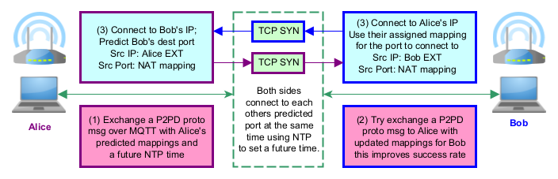

NAT prediction
=========================

NAT types
-----------

Home routers use NATs that dynamically create rules for the entry of
traffic into the network. The rules they use assign external ports (a mapping) to
redirect traffic to machines in the network. The NAT may have additional
criterial like whether traffic should come from a certain IP or port. The exact criteria will depend on the **NAT type.**

The algorithm for determining the NAT type is implemented by
testing which packets can make it back from a STUN request based
on changing the reply IPs and ports. You start by testing
the least restrictive first. This acts like a sieve,
eventually arriving at the correct NAT type.

Knowing the NAT type is useful because it indicates the criteria to reuse mappings. But what about NATs that have fixed IP requirements for inbound packets? If you look up a
mapping with a STUN server the router may require only packets
from that IP can use the mapping. Fortunately, there is another trick that helps here.
The **delta type**.

.. csv-table::
    :file: ../../diagrams/nat_characteristics.csv
    :header-rows: 1

----

Delta types
---------------

Delta type refers to the algorithm used by the router to choose an external port
for the mapping. Some delta types have the much desired quality of being
**predictable.** In fact: an 'equal' delta type will try to preserve the source port
used by a LAN client for the external mapping. In peer-to-peer networking knowing
the delta type gives us another tool to work with NAT implementations. A predictable
delta means being able able to create NAT openings more easily.

Depending on the type of delta there may also be a **delta value.** E.g. its common
for mappings to simply increase by 1 for every new mapping made. The delta type
here would be 'independent' with a value of +1. The table bellow shows other
possible algorithms for mapping deltas and values. With knowledge of the
NAT and delta we can move to the last section.

.. csv-table::
    :file: ../../diagrams/delta_characteristics.csv
    :header-rows: 1

----

Putting it all together
--------------------------

NATs dynamically allow a destination server. The server here is already reachable over the Internet but the interesting
part is **it need not be.** There's two scenarios where this makes sense.

UDP hole punching
^^^^^^^^^^^^^^^^^^^

UDP is 'connectionless' and if you can get two computers behind NATs to send
packets to each others respective mappings (while controlling what mapping you
are assigned to greatest extent possible) then a UDP session between both sides
can be created.

TCP hole punching
^^^^^^^^^^^^^^^^^^^^^

A regular TCP connection starts with a three-way handshake consisting of a SYN,
SYN-ACK, and ACK packet. Normally a connection is created by calling **connect()**
and pointing it at a **listen()ing** server which **accept()s** it. However, there is
a little known way to achieve a connection where **both sides call
connect() on each others external IP:port mappings at the same time.**

What needs to occur is the SYN packets need to cross their respective 
router before the other arrives. If this does not occur the router
has no rule for the inbound packet and discards it. But if the two sides are
synchronized -- both routers respond according to the steps in the two-way handshake -- 
and a new TCP connection is formed **without using any listen socket.**

.. NOTE::
    NAT type and delta type facilitate prediction of external mappings.
    Mappings are the ports a router assigns for use by a LAN IP and port.
    UDP and TCP hole punching depend on predicting mappings of
    peers. Hence the need to analyze NAT behaviors.

See nat_test.py, nat_predict.py, and nat_utils.py for implementation details.

----

Credits
---------

It's important to note that the information on this page came from many sources
including papers. They weren't my ideas. The STUN client was originally from jtriley/pystun. That client has since been replaced to reuse  message definitions from my TURN client to reduce duplication. While the NAT test code has been re-written from scratch to improve speed,
support IPv6, and fix bugs that were in the original code.

The information on delta types came from research papers on NAT
characteristics. I implemented algorithms to characterize delta types
based on the descriptions they provided in their papers. I will find and cite
such work when the time permits me.