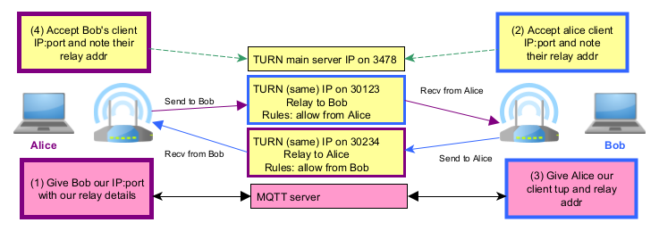

TURN client for proxying
==========================

TURN is a protocol used for relaying TCP and UDP packets between clients.
P2PD implements an asynchronous, IPv4 / IPv6, TURN client (only with UDP.)
It has the same interface as a pipe for convenience. To make things easier:
messages are acked but ordering is not yet provided.

The reason UDP was chosen is due how TURN is designed. P2PD already implements
**TCP: direct connect, reverse connect, and hole punching.**
If all of these fail it means there is little chance of establishing a direct
connection. But TURN requires TCP connections are made from the server
to the destination. TURNs UDP design reverses that which avoids these issues.

.. TIP::
    When you go through the TURN protocol you get allocated a 'relay address'
    that another peer can use to route messages to you. As far as I know
    this only works for UDP. But importantly it offers a reverse 'connect'
    design which is better for bypassing NATs. 

----

A TURN client example
-------------------------

.. literalinclude:: ../../examples/example_10.py
    :language: python3

----

Using TURN as a fall-back option
-----------------------------------

P2PD uses three main strategies to establish a TCP connection. By default TURN
is disabled because it uses UDP. However, it can be enabled easily.

See :ref:`turn relaying <connect-turn-relaying>` for details.