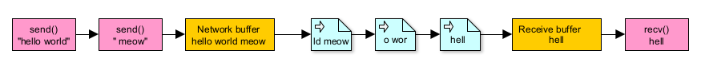

Basic concepts
================

The operating systems network stack abstracts offers developers high-level
features that are easier to work with than dealing with hardware directly.
If the developer uses TCP they don't have to worry about things like bit
errors due to electrical interference, packet loss, and so on. But these
APIs aren't as user-friendly as they might initially appear. One way
they might trip up newer engineers is the way they buffer data.

You see, when you hit the send() call it makes sense that once it finishes
the data has been dispatched. When in reality multiple send calls may
be concatenated together and arrive as one big blob. Theoretically, if you
wanted to send data with TCP each byte of the message might be transmitted
as an individual packet. And what about recv()? The OS buffers received data.
You can ask for as much data as you like but if it doesn't exist or
isn't optimal to send it -- then you're not going to get the full amount.
This is what it means for TCP to be 'stream orientated.'

.. WARNING::
    | TCP data arrives in any number of pieces! TCP buffers send and recv calls.
    | So there is no way to know when data is sent.

Protocol design
-----------------

Now, think about writing a TCP web server that properly respects how TCP works.
It 'knows' what a full HTTP request looks like because the request either
ends with '\r\n\r\n' OR the client indicates they're done sending.
The server will get some data from the client, look to see if it has a
full request to process, otherwise, it will keep checking until it does.
That would be a simple, delimiter-orientated protocol using markers to
signify where messages start and stop.

There are other ways to design protocols though. You could start with a fixed
header of known length. The header would then describe the length and kind of
data that is to follow. STUN uses this approach for messages because the messages
may contain attributes. For example: a STUN message may contain attributes like the
version and relay address.

.. WARNING::
    TCP callbacks in P2PD may contain partial or buffered data!

What about UDP?
-----------------

UDP is another way to transfer data. UDP doesn't have the reliabilities of TCP
but it does have a feature that makes it much less annoying: no buffering.
What this means is receivers for UDP data will receive messages exactly
as they were sent. Of course, data may be split up by the networking stack but
these details will be hidden. So as to simulate receiving unbroken messages.

The downside of using UDP is that messages my arrive in any order. Assuming
they arrive at all. This is because unlike UDP -- a UDP message has no
acknowledgement and may be lost in transit. So most clients that work with UDP
have a simple loop that sends off packets and checks for a reply. The process
can be repeated until it succeeds or times out.

UDP is a very useful protocol and far from obscure. For instance -- many
of the latest developments in network protocols are being built on UDP.
The connectionless nature of UDP allows broken connections to be easily resumed;
lack of buffering to reduce latency; and message-orientated approach make it
more desirable to developers.

Indeed: it seems that what developers really want from a networking API is
something that performs logically like UDP but with the ordered delivery guarantees
that made TCP famous. So if you want to know what the Internet looks like in the
future -- look no further than UDP.