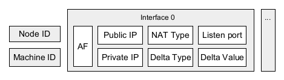

Peer addresses
================

P2PD nodes communicate their network details through a structured
address format.  Understanding this format is not required for basic
use — the nickname system hides it — but it explains how the library
achieves reliable connectivity across complex network configurations.

----

The address format
-------------------

A typical P2PD address looks like this:

.. code-block:: text

    0,1-[1,0,8.8.8.8,192.168.21.21,58959,3,2,0]-0-zmUGXPOFxUBuToh-easdasd

Breaking it down left to right:

.. list-table::
   :header-rows: 1
   :widths: 25 75

   * - Field
     - Meaning
   * - **Signaling offsets**
     - Indices of MQTT servers this peer subscribes to for signaling.
   * - **Netiface offset**
     - Absolute index of the NIC on the machine (maps to OS interface list).
   * - **Interface offset**
     - Position of this interface in the node's ordered list of interfaces.
   * - **External IP** (``8.8.8.8`` above)
     - WAN IP discovered via STUN.  What the Internet sees.
   * - **Internal IP** (``192.168.21.21`` above)
     - Private LAN IP of the NIC.
   * - **Listen port** (``58959``)
     - Port the node server is accepting connections on.
   * - **NAT type** (``3``)
     - Integer encoding the NAT classification (see :doc:`punch_deep`).
   * - **Delta type** (``2``)
     - Integer encoding the port-mapping delta algorithm.
   * - **Delta value** (``0``)
     - Parameter for the delta algorithm (e.g. step size).
   * - **Node ID**
     - ECDSA public key.  Also the MQTT topic this peer subscribes to.
   * - **Machine ID**
     - OS-generated unique identifier for the machine.

Multiple interfaces are represented as multiple bracket groups in the
same address string.  The maximum is 3 per address family (IPv4/IPv6).

----

Printing your node's address
------------------------------

.. code-block:: python

    from p2pd import *

    async def example():
        async with P2PNode() as node:
            print(node.addr_bytes.decode())

    async_test(example)

----

Why addresses include NAT information
----------------------------------------

Most P2P systems exchange raw IP addresses and let the application deal
with connectivity.  P2PD embeds NAT metadata directly in the address
so the library can automatically choose the best traversal strategy
without requiring any application-level knowledge:

1. **STUN** discovers the external IP and initial port mapping.
2. The **NAT type** tells the library how restrictive inbound filtering is.
3. The **delta type** and **delta value** let the library *predict* what
   external port will be assigned to a new connection before it exists.

Together these three pieces of information make TCP hole punching
possible across most NAT configurations.

----

Addresses across multiple interfaces
--------------------------------------

P2PD is the only P2P framework designed to manage multiple interfaces
simultaneously.  The address format reflects this: each interface
contributes an independent entry (external IP, internal IP, port, NAT
details).

When ``connect()`` is called, P2PD pairs each of *your* interfaces
with each of the *remote* node's interfaces and tries strategies on all
pairs until one succeeds.  This maximises reachability — for example, a
mobile device with both Wi-Fi and cellular interfaces has two
independent paths to peers.

.. code-block:: python

    from p2pd import *

    async def example():
        # Load all interfaces explicitly
        if_names = await list_interfaces()
        ifs = await load_interfaces(if_names)

        async with P2PNode(ifs=ifs) as node:
            print("Interfaces:", [i.name for i in node.ifs])
            print("Address:", node.addr_bytes.decode())

    async_test(example)
