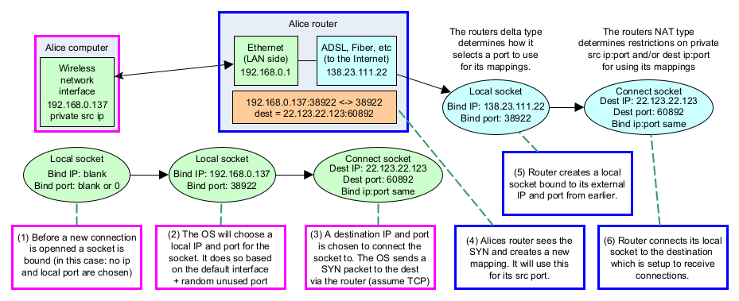

The connectivity problem
==========================

Why peer-to-peer is hard
--------------------------

When you open a browser and load a web page, the server has a fixed
public IP address and a known port.  Traffic flows in one direction:
**you initiate, the server responds.**

Peer-to-peer networking flips this.  Both sides may need to initiate
connections to each other.  The problem is that almost every home router
uses **Network Address Translation (NAT)** — a technique that hides an
entire household behind a single public IP.  From the outside, all
traffic appears to come from one address; from the inside, there is no
way to receive a connection nobody asked for.

.. code-block:: text

    ┌──────────────────────────────────────────────────────┐
    │  Your home network (private LAN)                     │
    │                                                      │
    │   ┌──────────────┐      ┌───────────────────────┐   │
    │   │ PC           │      │ Router / NAT          │   │
    │   │ 192.168.1.5  │─────▶│ WAN: 203.0.113.1      │──▶│──▶ Internet
    │   │ port 50000   │      │ maps :50000 → :54321  │   │
    │   └──────────────┘      └───────────────────────┘   │
    └──────────────────────────────────────────────────────┘

    Outbound packet:   src 192.168.1.5:50000  dst 8.8.8.8:80
    After NAT:         src 203.0.113.1:54321  dst 8.8.8.8:80

The router rewrites the source address and remembers the mapping.
When a reply arrives on port 54321 it forwards it back to
192.168.1.5:50000.  This works perfectly for **outbound** connections.

An **unsolicited inbound** packet arriving at port 54321 — from some
peer you haven't talked to yet — will be **dropped** by the router
because there is no rule for it.

----

Why simple workarounds fall short
------------------------------------

Port forwarding
^^^^^^^^^^^^^^^

You can tell the router "always forward port 1234 to my PC."  This
works for servers, but requires manual configuration on every router.
UPnP and NATPMP can automate this, but those features are often
disabled for security reasons and don't work behind double-NAT
(common on mobile networks).

Relay servers
^^^^^^^^^^^^^^^

Route all traffic through a public server that both sides can reach.
This is reliable but centralised and expensive.  Traffic must travel
twice the distance.  P2PD supports TURN as a *last resort*, not the
default path.

----

----

How P2PD solves the problem
-----------------------------

P2PD combines **four complementary strategies** — tried in order until
one succeeds.  The first three require no relay; the fourth is a
fallback.

.. code-block:: text

    ┌──────────────────────────────────────────────────────────────┐
    │  P2PD connectivity cascade                                   │
    │                                                              │
    │  1. Direct connect    ──── peer has public IP / UPnP works   │
    │  2. Reverse connect   ──── one side is reachable             │
    │  3. TCP hole punching ──── both behind NAT (most common)     │
    │  4. TURN relay        ──── last resort, always works         │
    └──────────────────────────────────────────────────────────────┘

On top of this, P2PD is designed from the ground up to work across
**multiple network interfaces** simultaneously (Wi-Fi + cellular on
a phone, for example) and across both **IPv4 and IPv6**.  This matters
because different interfaces have very different reachability profiles.

----

.. image:: ../../diagrams/architecture.png
    :alt: P2PD architecture diagram

----

Supporting infrastructure
---------------------------

P2PD relies entirely on open, widely-deployed protocols.  No custom
servers are required for the traversal machinery itself:

.. list-table::
   :header-rows: 1
   :widths: 20 80

   * - Protocol
     - Role in P2PD
   * - **STUN**
     - Discovers external IP and port mappings; classifies NAT type.
   * - **MQTT**
     - Relays short signaling messages between peers (not data traffic).
   * - **NTP**
     - Synchronises clocks to millisecond accuracy for hole punching.
   * - **UPnP / IGD**
     - Automates port forwarding on cooperative routers.
   * - **TURN**
     - Last-resort UDP/TCP relay when all else fails.
   * - **PNP**
     - P2PD's own naming system for human-readable peer addresses.

.. NOTE::
    MQTT is used only for *signaling* — exchanging the small messages
    needed to coordinate a direct connection.  Actual application data
    always travels peer-to-peer.

----

The NAT classification problem
---------------------------------

Not all NATs behave the same.  P2PD classifies each NAT on two axes:

**NAT type** — how strictly the router checks inbound traffic:

.. code-block:: text

    Open internet     (no NAT)
    Full cone NAT     (accepts from anywhere once mapping exists)
    Restricted cone   (accepts only from IPs you've sent to)
    Port restricted   (accepts only from the exact IP:port pair)
    Symmetric NAT     (assigns a *new* mapping for every destination)

**Delta type** — the algorithm the router uses to choose port numbers:

.. code-block:: text

    Equal         (external port == internal port — most predictable)
    Sequential    (each mapping increments by a fixed delta)
    Independent   (pattern exists but not tied to source port)
    Random        (unpredictable — hardest for hole punching)

Knowing both values lets P2PD predict what external port a peer will
be assigned *before* a mapping exists.  See :doc:`punch_deep` for how
this feeds into TCP hole punching.
