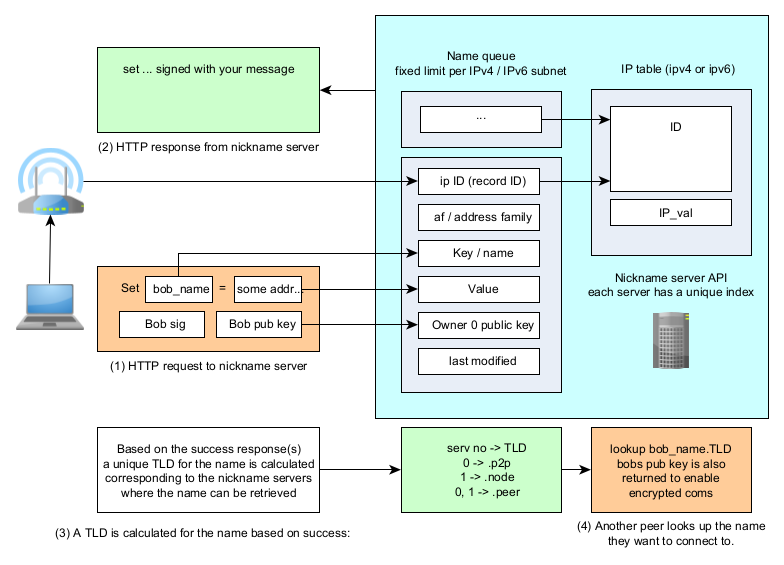

Nicknames
===========

A P2PD address is a long string encoding interface details, NAT type,
and cryptographic keys.  Sharing it directly is impractical.  Nicknames
give peers a short, memorable name — like a domain name for your node.

----

How nicknames work
--------------------

Registering a nickname involves:

1. Generating an ECDSA signing key pair (stored in ``~/.p2pd/``).
2. Making a signed HTTP registration request to a set of PNP name servers.
3. Checking which servers accepted the request — the subset that
   succeeded determines the **TLD** appended to your name.

The TLD is what makes names globally unique and resolvable without a
central registry.  A name ``"alice"`` might become ``"alice.peer"`` —
the ``.peer`` part identifies which quorum of name servers hold the
record.

.. NOTE::
    The full name (including TLD) is what you share with peers.
    ``await node.nickname("alice")`` returns ``"alice.peer"`` (or
    similar); do not share just ``"alice"``.

----

Registering and sharing a nickname
-------------------------------------

.. literalinclude:: ../../examples/guide_07_nickname.py
   :language: python3

**Run it:**

.. parsed-literal::

    python3 docs/examples/guide_07_nickname.py

    Raw address: 0,1-[1,0,203.0.113.42,...]-0-...
    Share this name: mynode.peer
    Example connect call:
      pipe = await other_node.connect("mynode.peer")

----

Connecting to a peer by nickname
-----------------------------------

.. code-block:: python

    from p2pd import *

    async def example():
        async with P2PNode() as node:
            # The peer registered "mynode.peer" earlier
            pipe = await node.connect("mynode.peer")
            async with pipe:
                await pipe.send(b"Hello!")
                reply = await pipe.recv()
                print(reply)

    async_test(example)

----

Name storage and keys
-----------------------

P2PD stores nickname data in ``~/.p2pd/``:

.. code-block:: text

    ~/.p2pd/
    ├── node_id.pem       # ECDSA key for node identity and signaling encryption
    ├── nick_<name>.pem   # Per-nickname signing key
    └── *.lock            # Port reservation locks (prevent zombie daemons)

Deleting a ``.pem`` file means you can no longer update that name — a
new registration will use a different key and may land on a different
TLD.

----

Name availability and limits
-------------------------------

P2PD name registration is **free and requires no account**.  The
system enforces a per-IP registration limit that acts as a queue:
once the limit is reached, the oldest registration is evicted.  This
prevents hoarding while keeping the service open.
