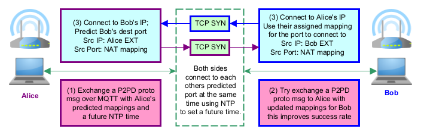

TCP hole punching — deep dive
================================

TCP hole punching is P2PD's most sophisticated connectivity strategy.
This page explains the theory and implementation in detail.

----

NAT mappings
-------------

When your computer opens an outbound TCP connection the router creates a
**mapping**: a rule that translates a private ``IP:port`` pair to a
public ``IP:port`` pair and back.

.. code-block:: text

    Private endpoint          Public endpoint
    192.168.1.5:40000  ────▶  203.0.113.1:54321

    Outbound packet:  src 192.168.1.5:40000   → rewritten → src 203.0.113.1:54321
    Inbound packet:   dst 203.0.113.1:54321   → rewritten → dst 192.168.1.5:40000

For hole punching to work, each peer must know the other's **public
endpoint** before a mapping exists.  STUN provides this.

----

NAT types
----------

The NAT type determines what additional criteria the router applies when
deciding whether to forward an inbound packet:

.. csv-table::
    :file: ../../diagrams/nat_characteristics.csv
    :header-rows: 1

Full-cone NAT is the most permissive: once a mapping exists, any remote
IP and port can use it.  Symmetric NAT is the most restrictive: it
creates a *new* mapping for every different destination, making port
prediction very difficult.

----

Delta types
------------

Delta type describes the algorithm a NAT uses to select the **external
port** number for each new mapping.  An **equal** delta NAT tries to
preserve the source port (private port == public port), making mappings
trivially predictable.

.. csv-table::
    :file: ../../diagrams/delta_characteristics.csv
    :header-rows: 1

Knowing the delta type and value lets P2PD predict the port a peer will
be assigned — even before that mapping exists — by observing a pattern
in previous mappings.

----

How punch timing works
------------------------

The critical requirement: both ``SYN`` packets must be **in flight at
the same time** so that each one arrives at the remote router *after*
the local router has already created a rule for it.

P2PD achieves this through NTP:

.. code-block:: text

    Both peers                NTP server
         │                        │
         │── query NTP time ─────▶│
         │◀─ timestamp ───────────│
         │                        │
         │  compute rendezvous = round_up(now, window_size)
         │                        │
         │  sleep until rendezvous
         │                        │
         │─── SYN ──────────────────────────────────────────▶│
         │◀── SYN ──────────────────────────────────────────│
         │                        │
         │  Both SYNs cross in flight → ESTABLISHED

The ``rendezvous time`` is the next multiple of a fixed window (e.g.
every 2 seconds) after the current NTP timestamp.  Both peers
independently calculate the same value and wake up simultaneously.

----

Port allocation
-----------------

Before punching, each peer must decide which ports to use for source
binding.  P2PD uses a **boundary allocator** that derives a
deterministic set of ports from the rendezvous bucket number.  This
means both peers allocate port ranges that overlap, maximising the
probability that a SYN from one side hits an open source port on the
other.

.. code-block:: python

    from p2pd.traversal.libs.punch.punch_client import PunchClient
    from p2pd.traversal.libs.punch.punch_defs import PortAlloc
    from p2pd.traversal.libs.punch.utility.boundary_lib import compute_rendezvous
    from p2pd.traversal.libs.punch.utility.punch_utils import timestamp_from_ntp
    from p2pd.traversal.libs.punch.port_allocators.boundary_alloc import boundary_port_alloc

    # Get NTP time
    ntp_ts = timestamp_from_ntp()

    # Both peers run this independently and get the same bucket
    bucket, punch_time = compute_rendezvous(ntp_ts)

    # Configure a punch client
    puncher = PunchClient(
        dest_ip="198.51.100.2",   # peer's external IP
        src_ip="192.168.1.5",     # our LAN IP
        our_ip="192.168.1.5",
        max_sleep=3,
        same_machine=False,
    )
    puncher.set_timestamp(ntp_ts)
    puncher.set_punch_time(punch_time)
    puncher.add_port_allocator(boundary_port_alloc)
    # puncher.port_allocs is now populated

----

Running the punch test suite
------------------------------

The test suite exercises all of the above on real sockets.

.. parsed-literal::

    python3 -m pytest tests/test_punch.py -v

The suite contains four test classes:

.. list-table::
   :header-rows: 1
   :widths: 30 70

   * - Class
     - What it tests
   * - ``TestPunchLoopback``
     - Two punchers on ``127.0.0.1`` (different source ports)
   * - ``TestPunchNicIPs``
     - Two punchers on different NIC IPs (skipped if only one IP)
   * - ``TestPunchIPv6Loopback``
     - IPv6 punch on ``::1``
   * - ``TestPunchIPv6NicIPs``
     - IPv6 punch across two NIC addresses

Individual tests within each class cover creation, port allocation,
NTP synchronisation, and (for NIC tests) actual socket creation:

.. parsed-literal::

    # Run only the NTP-synchronised test
    python3 -m pytest tests/test_punch.py \
        -k test_bidirectional_ntp_synchronized_punch -v

----

Manual two-machine test with ``punch.py``
------------------------------------------

The ``examples/punch.py`` script lets you test hole punching between
two real machines (or two IPs on the same machine without a NAT):

.. parsed-literal::

    # Machine A — start a listening server
    python3 -c "
    import socket
    s = socket.socket()
    s.bind(('10.0.1.76', 40000))
    s.listen()
    print('Listening...')
    conn, addr = s.accept()
    print('Connected from', addr)
    "

    # Machine B — run the punch program
    python3 examples/punch.py 10.0.1.76

On success, ``punch.py`` prints the local port(s) that connected.

----

Limitations
------------

Hole punching does **not** work in all situations:

- **Symmetric NAT + random delta on both sides**: port prediction is
  impossible; fall back to TURN.
- **Strict firewall rules** that block unsolicited TCP SYN packets
  regardless of existing UDP state.
- **Carrier-grade NAT (CGNAT)**: multiple layers of NAT may prevent
  simultaneous-open from working; P2PD may succeed via TURN.

P2PD detects these conditions and falls back gracefully.
