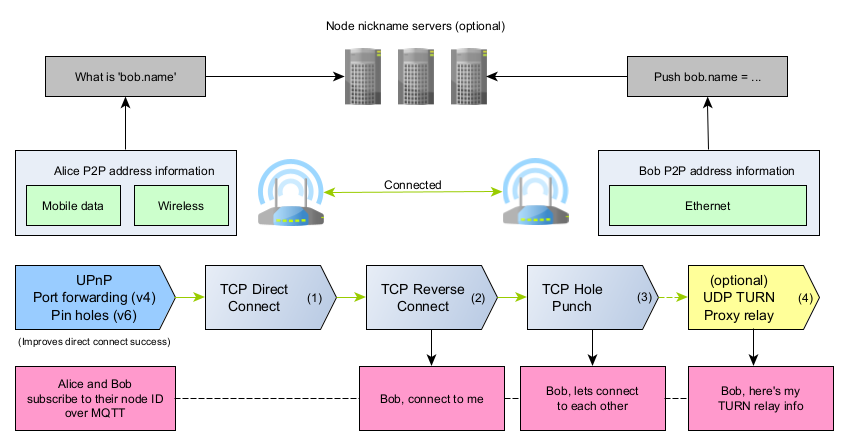
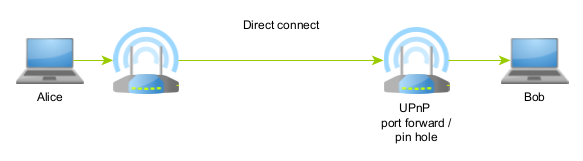
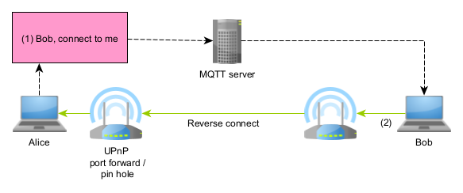
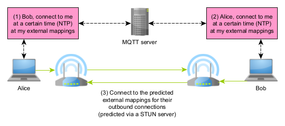
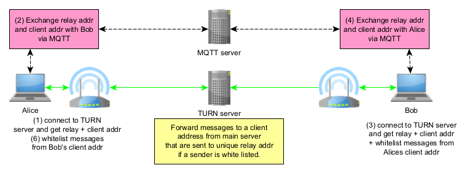

Connectivity strategies
==========================

P2PD tries each strategy in the order shown below, returning the first
pipe that succeeds.  You can also request specific strategies.

----

Strategy 1 — Direct connect
-----------------------------

**When it works:** the destination node has a publicly reachable IP
address, or its router has UPnP enabled and has forwarded a port.
This is typical for servers in a data centre or any machine that has
done explicit port forwarding.

.. code-block:: text

    ┌──────────┐                           ┌───────────────┐
    │  Peer A  │  ──── TCP connect() ────▶ │  Peer B       │
    │          │                           │ (public IP or │
    │          │  ◀──── accept() ─────────  │  UPnP port)   │
    └──────────┘                           └───────────────┘

**Code example:**

.. literalinclude:: ../../examples/tcp_direct_connect.py
   :language: python3

**Testing direct connect locally:**

.. parsed-literal::

    # Terminal 1: run the guide server example
    python3 docs/examples/guide_02_strategies.py server

    # Terminal 2: connect using only the direct strategy
    python3 docs/examples/guide_02_strategies.py direct <nickname>

----

Strategy 2 — Reverse connect
--------------------------------

**When it works:** *you* are publicly reachable (or have UPnP) but the
*remote* peer is not.  P2PD sends a signaling message over MQTT asking
the remote peer to connect back to you.

.. code-block:: text

    ┌──────────┐   MQTT signal    ┌──────────┐
    │  Peer A  │ ───────────────▶ │  Peer B  │
    │ (public) │                  │ (behind  │
    │          │ ◀── TCP connect ─│  NAT)    │
    └──────────┘                  └──────────┘
                    via broker

The connection is still fully peer-to-peer once established.  MQTT is
only used for the initial "please call me back" message.

**Code example:**

.. literalinclude:: ../../examples/tcp_reverse_connect.py
   :language: python3

**Testing:**

.. parsed-literal::

    python3 docs/examples/guide_02_strategies.py reverse <nickname>

----

Strategy 3 — TCP hole punching
---------------------------------

**When it works:** both peers are behind NAT but neither is publicly
reachable.  This is the most common real-world scenario.

The key insight: if both peers send a TCP ``SYN`` packet to each
other's **external** ``IP:port`` *at the same time*, each ``SYN``
creates a rule in the sender's router that allows the incoming ``SYN``
from the other side.  A connection forms without any ``listen()``
socket.

.. code-block:: text

    Peer A (behind NAT-A)        Peer B (behind NAT-B)
    LAN: 192.168.1.5:40000       LAN: 10.0.0.7:40000
    WAN: 203.0.113.1:54321       WAN: 198.51.100.2:61234

    ① A sends SYN → 198.51.100.2:61234   (opens rule in NAT-A)
    ② B sends SYN → 203.0.113.1:54321    (opens rule in NAT-B)

    ③ A's SYN reaches NAT-B — allowed (rule created by ②)
    ③ B's SYN reaches NAT-A — allowed (rule created by ①)

    ④ Both sides receive SYN simultaneously → TCP state machine
       transitions to ESTABLISHED without any listen() socket.

Timing must be accurate to milliseconds.  P2PD uses NTP to synchronise
both clocks to a shared *rendezvous time*.

.. NOTE::
    NAT type and delta type let P2PD *predict* the external port before
    creating a mapping.  See :doc:`punch_deep` for the full picture.

**Code example:**

.. literalinclude:: ../../examples/tcp_hole_punch.py
   :language: python3

**Testing hole punch locally:**

.. parsed-literal::

    # Runs bidirectional punch tests using local IPs
    python3 -m pytest tests/test_punch.py -v

----

Strategy 4 — TURN relay
--------------------------

**When it works:** always, but at the cost of routing all traffic
through a third-party relay server.  Used as a last resort when direct,
reverse, and hole-punch all fail (e.g. symmetric NAT on both sides with
unpredictable delta).

.. code-block:: text

    ┌──────────┐               ┌─────────────┐               ┌──────────┐
    │  Peer A  │──────────────▶│ TURN server │──────────────▶│  Peer B  │
    │          │◀──────────────│  (relay)    │◀──────────────│          │
    └──────────┘               └─────────────┘               └──────────┘

.. WARNING::
    TURN relay uses UDP and therefore has no delivery ordering guarantees.
    P2PD adds acknowledgements, but data may arrive out of order.
    TURN is **not** included in the default strategy list for this reason.

**Code example:**

.. literalinclude:: ../../examples/udp_turn_relay.py
   :language: python3

----

All strategies combined
-------------------------

This is the recommended starting point.  P2PD will pick the best
available strategy automatically.

.. literalinclude:: ../../examples/guide_02_strategies.py
   :language: python3

**Run the full strategy example:**

.. parsed-literal::

    # Terminal 1
    python3 docs/examples/guide_02_strategies.py server

    # Terminal 2 — tries direct, then reverse, then punch
    python3 docs/examples/guide_02_strategies.py all <nickname>
