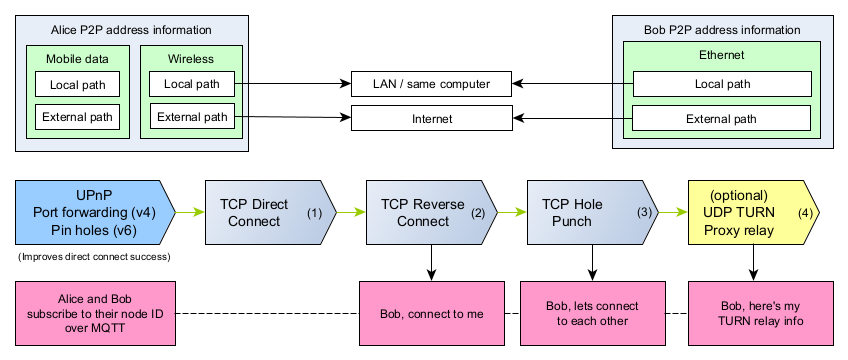

Connection strategies
======================

This section covers how P2PD achieves a TCP connection with another machine.
The techniques P2PD uses are tried for your different network interface(s)
which are then paired with the destination's interface(s). Each strategy has
two paths it can take -- a **local path** and an **external path**. Local paths
will only be used if the destination is on the same machine or in the
same LAN; External paths are routed over the Internet.

That means that P2PD is designed to work with any number of interfaces,
address families, or network configurations. Making it a very flexible system
for achieving connectivity. But how exactly does it do this? Let's look
into some of the main strategies it uses to setup TCP connections.

----

1. Direct Connect
-----------------------

.. image:: ../../diagrams/tcp_direct_connect.png
    :alt: Diagram of TCP direct connect

On the rare occasion a destination node is reachable directly a simple TCP
connection is appropriate. If any of its routers support UPnP then connectivity
can be ensured automatically. Assuming that the node is behind a NAT. For
machines in data centers they are often directly reachable. Otherwise, they
may need firewall rules to be setup.

.. literalinclude:: ../../examples/tcp_direct_connect.py
    :language: python3

----

1. Reverse Connect
-----------------------

.. image:: ../../diagrams/tcp_reverse_connect.png
    :alt: Diagram of reverse connect

TCP connections are double-sided in the sense that you can connect to
a service or receive them. Here it doesn't matter whether you initiate
the connection or they do. Reverse connect tells the other side to connect
to you by using MQTT messages (via third-party MQTT servers.)

What's useful about reverse connect is it means connectivity is possible
if either side is reachable. So UPnP doesn't have to be enabled by both.
Such possibilities greatly improve reachability when we can expect that
UPnP isn't always going to be enabled. 

.. literalinclude:: ../../examples/tcp_reverse_connect.py
    :language: python3

----

1. TCP Hole Punching
---------------------------

.. image:: ../../diagrams/tcp_hole_punch.png
    :alt: Diagram of P2P connectivity methods

fillter text

.. literalinclude:: ../../examples/tcp_hole_punch.py
    :language: python3

----

1. TURN Relaying
------------------

TURN is a protocol that provides a generic proxy service for TCP and
UDP traffic. It is utilized within WebRTC as a last resort approach
for connecting peers when all other connection establishment options have
failed. Since TURN servers must relay all traffic between peers it
is much more expensive and centralized than other options. Hence why TURN
is only used as a last resort.

In P2PD TURN support is not part of the default strategies for P2P connections
as it utilizes UDP instead of TCP which would be inconsistent with other
approaches. The TURN client I have implemented includes a feature
that automatically acknowledges messages and retransmits them.
Though sequencing has not been provided. The client is implemented in
such a way that it provides an identical API to the connections returned
from following any of the above strategies.

.. literalinclude:: ../../examples/udp_turn_relay.py
    :language: python3

