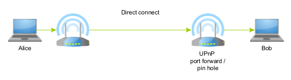

Connection methods
======================

This section covers how P2PD achieves a TCP connection with another machine.
The techniques used are tried for different network interface(s)
which are then paired with a destination's interface(s). Each strategy has
two paths it can take -- a **local path** and an **external path**. Local paths
will only be used if the destination is on the same machine or in the
same LAN; External paths are routed over the Internet.

.. image:: ../../diagrams/connectivity.png
    :alt: Diagram of P2P connectivity methods

P2PD is designed to work with any number of interfaces,
address families, or network configurations. Making it very flexible for achieving connectivity. The downside is it can take a while to setup
a connection depending on the reachability characteristics between the two nodes.
This is because many interfaces, methods, and paths may have to be tried
to get a connection opened. But once that's complete the connection functions as
any other connection.

----

1. Direct Connect
-----------------------

If a destination node is reachable directly a simple TCP
connection is appropriate. If any of its routers support UPnP then connectivity
can be ensured automatically. Assuming a node is behind NAT. For
machines in data centers they are often directly reachable. Otherwise, they
may need firewall rules to be setup.

.. literalinclude:: ../../examples/tcp_direct_connect.py
    :language: python3

----

2. Reverse Connect
-----------------------

TCP connections are double-sided in the sense that you can connect to
a service or receive them. Here it doesn't matter whether you initiate
the connection or they do. Reverse connect tells the other side to connect
back to you by using MQTT messages (via third-party MQTT servers.)

What's useful about reverse connect is it means connectivity is possible
if either side is reachable. So UPnP doesn't have to be enabled by both.
Such possibilities greatly improve reachability when we can expect that
UPnP isn't always going to be enabled. 

.. literalinclude:: ../../examples/tcp_reverse_connect.py
    :language: python3

----

3. TCP Hole Punching
---------------------------

TCP hole punching relies on the strange behavior of the TCP three-way
handshake to succeed when both sides to a connection connect to each
other at the same time. If the timing for this is synchronized -- and I do mean
with millisecond accuracy -- then both SYN packets will cross their respective
routers before the other arrives -- spawning a new TCP connection.

P2PD's hole punching features are advanced. They support punching
over the Internet; over the LAN; to different interfaces on the same machine;
on the same interface; with either single initial mappings or updated mapping
messages. And it works hand-in-hand with detailed NAT enumeration and port prediction methods.

.. literalinclude:: ../../examples/tcp_hole_punch.py
    :language: python3

----

.. _connect-turn-relaying:

4. TURN Relaying
------------------

.. image:: ../../diagrams/udp_turn_relay.png
    :alt: Diagram of P2P connectivity methods

TURN is a protocol that provides a generic proxy service for TCP and
UDP traffic. It is utilized in WebRTC as a last resort approach
for connecting peers when other options have failed. Since TURN servers
must relay all traffic between peers it is more centralized than
other options. Hence why TURN is only used as a last resort.

In P2PD TURN support is not part of the default connectivity methods
as it utilizes UDP. For TURN: P2PD implements acknowledgements but data 
arrives unordered for TURN / UDP.

.. literalinclude:: ../../examples/udp_turn_relay.py
    :language: python3

----

All approaches combined
-----------------------------

Now that you understand how the various approaches work. Here
is some simple code that uses the above techniques to create
a peer-to-peer TCP connection. The next section will show you 
how to write a protocol for your peer-to-peer node.

.. literalinclude:: ../../examples/p2p_tcp_con.py
    :language: python3