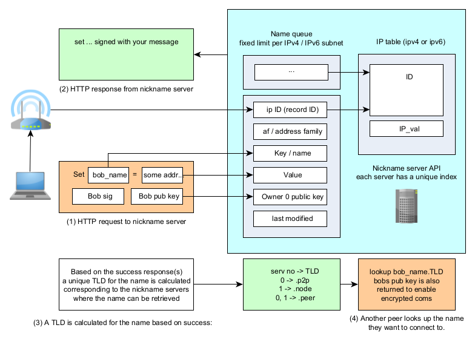

Nicknames
----------

Your P2P node has an address that lists information on all of your network
interface cards used for the node and meta data for encryption communications.
The address is however very long. Similar, to IP addresses, working with
these addresses directly is cumbersome. Can you imagine having to read
numbers to a friend and hope they enter them all correctly? Fortunately,
P2PD has a simple solution this: nicknames.

Your node can be given a unique, human-readable name, that can be used
to look up the address. Like a phone book, a collection of servers
contain these records. What's cool about this system though is that
it requires no registration at all to use. Instead, there's a fixed limit
of names that can be registered per IP address and the limit acts as a queue.
When the queue fills up -- the most recent registrations bump off old ones.

